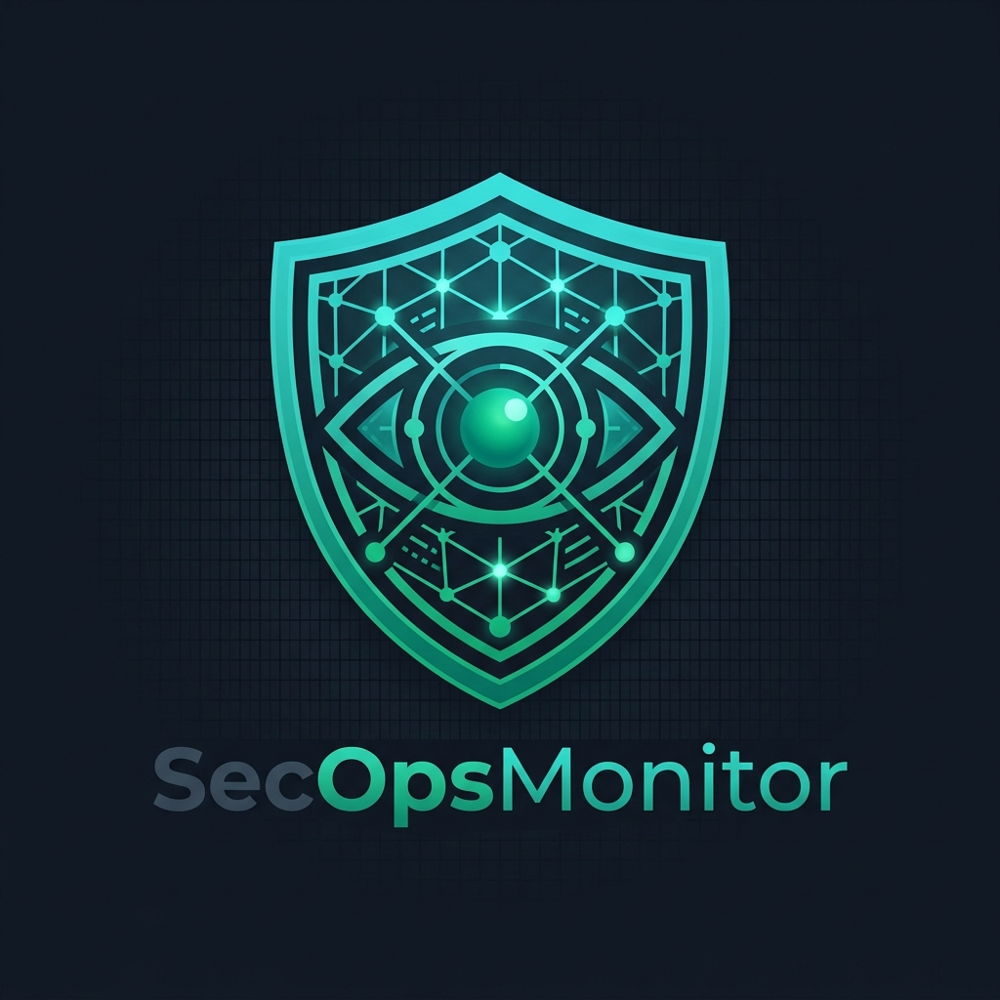

<p align="center">
  
</p>

<h1 align="center">SecOpsMonitor</h1>

<p align="center">
  <strong>Passive ICS/SCADA Network Discovery, Vulnerability Intelligence & Security Assessment Platform</strong><br/>
  Full-Stack OT Security Tool with Real PCAP Processing, Protocol Dissection, Threat Detection & ICS Advisory Feed
</p>

<p align="center">
  
  
  
  
  
  
  
</p>

<p align="center">
  <a href="https://your-org.github.io/SecOpsMonitor/"><strong>🔴 Live Demo</strong></a> &middot;
  <a href="https://secopsmonitor.net">Website</a> &middot;
  <a href="#screenshots">Screenshots</a> &middot;
  <a href="#installation">Installation</a> &middot;
  <a href="#key-features">Features</a>
</p>

---

## What is SecOpsMonitor?

SecOpsMonitor is a **fully functional** passive ICS/SCADA network discovery and security assessment platform. It analyzes captured network traffic (PCAP files) to automatically identify industrial devices, map communication patterns, detect protocol anomalies, perform C2/beacon detection, match CVEs, and generate professional assessment reports — **without transmitting a single packet** to the monitored network.

Unlike tools that are just dashboards on top of mock data, SecOpsMonitor has a **real processing monitor-api** powered by Scapy, with deep packet inspection for 6 ICS protocols, a C2 beacon detection engine, NVD CVE integration, ICS vulnerability intelligence from 7 advisory sources, and PDF report generation.

> **SecOpsMonitor never actively scans or probes the industrial network. All discovery is done by passive traffic analysis only.**

---

## Architecture

```
┌────────────────────────────────────────────────────────────────┐
│                    Frontend (React 19 + Vite)                  │
│  30+ Pages · Topology Graph · Protocol Analysis · Dark Theme   │
├────────────────────────────────────────────────────────────────┤
│                         REST API                               │
├────────────────────────────────────────────────────────────────┤
│                  Backend (FastAPI + Python)                     │
│  ┌──────────┐ ┌──────────────┐ ┌────────────┐ ┌────────────┐  │
│  │  PCAP    │ │  Protocol    │ │    C2      │ │   CVE      │  │
│  │Processor │ │  Parsers     │ │ Detector   │ │  Lookup    │  │
│  │ (Scapy)  │ │ (6 parsers)  │ │(IAT/DNS/  │ │(NVD API +  │  │
│  │          │ │              │ │ Asymmetric)│ │ Offline DB)│  │
│  └──────────┘ └──────────────┘ └────────────┘ └────────────┘  │
│  ┌──────────┐ ┌──────────────┐ ┌────────────┐                 │
│  │  Vuln    │ │   Device     │ │   Risk     │                 │
│  │  Feed    │ │ Classifier   │ │Assessment  │                 │
│  │(7 Source)│ │(Purdue/OUI)  │ │  Engine    │                 │
│  └──────────┘ └──────────────┘ └────────────┘                 │
│  ┌──────────┐                                                  │
│  │  Report  │                                                  │
│  │Generator │                                                  │
│  │(PDF/HTML)│                                                  │
│  └──────────┘                                                  │
├────────────────────────────────────────────────────────────────┤
│              SQLite Database (aiosqlite)                        │
│  17 Tables · Sessions · Devices · Connections · Findings       │
└────────────────────────────────────────────────────────────────┘
```

---


## Performance & Scalability

SecOpsMonitor is designed for high-throughput OT environments:
- **Asynchronous Ingestion**: FastAPI + Celery handles large PCAP files without blocking the UI.
- **Resource Efficient**: Optimized Scapy parsers and SQLAlchemy indexing for fast metadata retrieval.
- **Stateless Architecture**: Scalable across multiple containers with Redis for task queueing and caching.

---

## Key Features

### Real PCAP Processing Engine (Not Mock Data)

SecOpsMonitor includes a **fully functional monitor-api** — not just a UI prototype. When you upload a PCAP file, the system:

1. **Ingests** — Streams packets via Scapy's `PcapReader` (handles large files efficiently)
2. **Dissects** — Deep packet inspection for 6 ICS protocols with function code analysis
3. **Classifies** — Assigns device types, Purdue levels, vendors (38 OUI prefixes)
4. **Detects** — Runs C2 beacon detection, Purdue violation checks, write path analysis
5. **Stores** — Persists all results in SQLite with 17 normalized tables

### ICS/OT Vulnerability Intelligence Feed

Real-time advisory aggregation from **7 OT-specific sources** with CVSS v3.1 + CISA KEV + EPSS enrichment:

| Source | Coverage |
|---|---|
| **CISA ICS-CERT** | All ICS advisories |
| **Siemens ProductCERT** | SIMATIC, SCALANCE, SINEMA |
| **Schneider Electric** | Modicon, EcoStruxure, Magelis |
| **Rockwell Automation** | ControlLogix, CompactLogix, FactoryTalk |
| **ABB** | Ability, Symphony, ASPECT |
| **Moxa** | EDR, EDS Series, ioLogik |
| **CERT@VDE** | German industrial automation |

**Features:**
- 4-tier urgency classification: **Act Now** / **Plan Patch** / **Monitor** / **Low Risk**
- Environment personalization — select your vendors and sectors for matched alerts
- EPSS probability scoring for exploit likelihood
- CISA KEV flagging for known exploited vulnerabilities
- CSV export for compliance reporting

### ICS Protocol Deep Packet Inspection

| Protocol | Port | What SecOpsMonitor Extracts |
|---|---|---|
| **Modbus TCP** | 502 | MBAP header, function codes (FC 1-43), register addresses, write detection, master/slave identification |
| **S7comm (Siemens)** | 102 | TPKT/COTP/S7 header parsing, job types (0x01-0x07), program upload/download flagging |
| **EtherNet/IP / CIP** | 44818 | Encapsulation header, CIP service codes, tag read/write operations |
| **DNP3** | 20000 | DLL + transport + application layer, master/outstation detection, object group parsing |
| **BACnet** | 47808 | BVLC/NPDU/APDU parsing, service identification, I-Am/Who-Is discovery |
| **IEC 60870-5-104** | 2404 | APDU type detection (I/S/U format), type ID parsing, cause of transmission |

### C2 / Beacon Detection Engine

Three independent detection methods run on every session:

- **IAT Histogram Analysis** — Detects periodic beaconing by analyzing inter-arrival time distributions. Uses coefficient of variation threshold (<0.15) with ICS polling exclusion to reduce false positives
- **DNS Exfiltration Detection** — Shannon entropy analysis per DNS subdomain label. Flags labels with entropy >4.0 (typical of base64/hex encoded data tunneling)
- **Asymmetric Flow Analysis** — Identifies suspicious data transfers with TX:RX ratio >20:1 and total volume >100KB

### CVE Vulnerability Matching

- **Offline ICS CVE Database** — 12 pre-loaded real OT CVEs (Siemens, Schneider Electric, Rockwell Automation, ABB, Fortinet, Moxa)
- **NVD API v2.0 Integration** — Live search against NIST National Vulnerability Database with optional API key
- **Device Matching** — Fuzzy matches discovered device vendors/firmware against known CVEs

### Professional Report Generation

- **PDF Reports** — WeasyPrint-powered professional assessment reports with cover page, executive summary, device tables, protocol analysis, findings, and recommendations
- **HTML Fallback** — Complete HTML report when WeasyPrint is not installed
- **Report Sections** — Executive Summary, Device Inventory, Protocol Analysis, Security Findings, Recommendations

### Network Topology & Device Classification

- **Purdue Model Assignment** — Automatic L0-L5 + DMZ classification based on protocol behavior
- **Device Type Detection** — PLC, HMI, Engineering Workstation, Historian, RTU, IED, Gateway
- **Vendor Identification** — 38 OUI MAC address prefixes covering Siemens, ABB, Rockwell, Schneider, Moxa, Beckhoff, Phoenix Contact, and more
- **Confidence Scoring** — 5-level scoring (port-only → deep parse)

### Security Assessment

- **MITRE ATT&CK for ICS** — 40+ detection rules mapped to techniques
- **Purdue Violation Detection** — Automated cross-zone communication anomaly detection
- **Write/Program Path Detection** — Flags dangerous Modbus writes, S7 program uploads, CIP tag writes
- **Default Credential Detection** — Checks for common ICS default passwords
- **Baseline Drift** — Quantified drift score between assessment sessions

### 50+ REST API Endpoints

| Category | Endpoints | Description |
|---|---|---|
| **Auth** | 4 | Register, login, demo login, profile |
| **PCAP** | 3 | Upload, status, list |
| **Devices** | 4 | List, topology, stats, detail |
| **Sessions** | 6 | CRUD + projects |
| **Findings** | 4 | List, stats, status update |
| **CVE** | 2 | Search NVD, match devices |
| **Vuln Feed** | 10 | Advisories, stats, sources, export, environment config |
| **Reports** | 3 | Generate, download, list |
| **Ontology** | 4 | Types, graph, CRUD |
| **Dashboard** | 3 | Stats, saved dashboards |
| **Scanners** | 4 | Semgrep, Trivy, SARIF, generic import |

---

## Installation

### Option 1: Docker (Recommended — Linux & macOS)

The fastest way to get SecOpsMonitor running. No Python or Node.js installation needed.

```bash
# Clone and start
git clone https://github.com/your-org/SecOpsMonitor.git
cd SecOpsMonitor
docker compose up --build

# That's it! Open http://localhost:3000
```

| Service | URL |
|---|---|
| **Frontend** | http://localhost:3000 |
| **API Docs** | http://localhost:8000/docs |
| **Login** | Click "Demo Login" — no credentials needed |

```bash
# Stop
docker compose down

# Production setup (PostgreSQL + Redis + Celery worker)
docker compose -f docker-compose.prod.yml up --build
```

### Option 2: One-Click Installer (macOS / Linux)

Single command that auto-detects Docker or falls back to native install:

```bash
# Run directly from GitHub
curl -fsSL https://raw.githubusercontent.com/your-org/SecOpsMonitor/main/scripts/install.sh | bash

# Or clone first, then run
git clone https://github.com/your-org/SecOpsMonitor.git
cd SecOpsMonitor
bash scripts/install.sh
```

The installer will:
1. Detect Docker → use containerized setup (preferred)
2. No Docker → install Python + Node.js dependencies natively
3. Start both monitor-api and ui-monitor
4. Open your browser automatically

### Option 3: Windows (.bat Launcher)

```powershell
# PowerShell one-liner
git clone https://github.com/your-org/SecOpsMonitor.git
cd SecOpsMonitor

# Option A: Double-click secopsmonitor.bat in File Explorer
# Option B: Run from PowerShell
.\scripts\install.ps1
```

**`secopsmonitor.bat`** — Double-click to launch. Auto-detects Docker Desktop or falls back to native Python + Node.js. Opens browser when ready. Press any key to stop.

> **Prerequisites for native (non-Docker) install:**
> - [Python 3.9+](https://python.org/downloads/) (check "Add to PATH" during install)
> - [Node.js 18+](https://nodejs.org/) (LTS recommended)
> - [Git](https://git-scm.com/download/win)

### Option 4: Manual Setup

```bash
# 1. Clone the repository
git clone https://github.com/your-org/SecOpsMonitor.git
cd SecOpsMonitor

# 2. Start the Backend
cd monitor-api
python3 -m pip install -e ".[dev]"
python3 -m uvicorn app.main:app --host 0.0.0.0 --port 8000

# 3. In a new terminal — Start the Frontend
cd ui-monitor
npm install
npm run dev
```

- **Backend API**: http://localhost:8000 (Swagger docs at `/docs`)
- **Frontend UI**: http://localhost:5174
- **Demo Login**: Click "Demo Login" on the login page — no credentials needed

### Backend Optional Dependencies

```bash
# For PDF report generation
pip install "secopsmonitor[pdf]"

# For PostgreSQL (production deployments)
pip install "secopsmonitor[postgres]"

# Install everything
pip install "secopsmonitor[full]"
```

### Environment Variables

Create `monitor-api/.env` for monitor-api configuration:

```env
SECOPS_DATABASE_URL=sqlite+aiosqlite:///./secopsmonitor.db
SECOPS_SECRET_KEY=your-secret-key-change-in-production
SECOPS_NVD_API_KEY=your-nvd-api-key        # Optional: for faster CVE lookups
SECOPS_DEBUG=true
```

Create `ui-monitor/.env.local` for ui-monitor overrides:

```env
VITE_API_URL=http://localhost:8000
VITE_DEMO_MODE=true
```

---

## Usage

### 1. Upload a PCAP for Analysis

```bash
# Via API
curl -X POST http://localhost:8000/api/v1/ics/pcap/upload \
  -F "file=@capture.pcap" \
  -F "session_name=Plant Assessment Q1"

# Check processing status
curl http://localhost:8000/api/v1/ics/pcap/status/{pcap_id}
```

Or use the **Capture → PCAP Analysis** page in the UI to drag-and-drop a PCAP file.

### 2. Explore Discovered Devices

```bash
# List all devices in a session
curl http://localhost:8000/api/v1/ics/devices/?session_id={session_id}

# Get network topology (nodes + edges)
curl http://localhost:8000/api/v1/ics/devices/topology?session_id={session_id}

# Device statistics
curl http://localhost:8000/api/v1/ics/devices/stats?session_id={session_id}
```

### 3. Check ICS Vulnerability Advisories

```bash
# List all advisories
curl http://localhost:8000/api/v1/ics/advisories/

# Get advisory stats
curl http://localhost:8000/api/v1/ics/advisories/stats

# Match advisories against session devices
curl http://localhost:8000/api/v1/ics/advisories/matched?session_id={session_id}

# Export to CSV
curl http://localhost:8000/api/v1/ics/advisories/export/csv
```

### 4. Review Security Findings

```bash
# List findings by severity
curl http://localhost:8000/api/v1/ics/findings/?severity=critical

# Match devices against CVE database
curl http://localhost:8000/api/v1/ics/findings/cve/match-devices?session_id={session_id}

# Search NVD for CVEs
curl http://localhost:8000/api/v1/ics/findings/cve/search?keyword=siemens+s7
```

### 5. Generate Assessment Report

```bash
curl -X POST http://localhost:8000/api/v1/ics/findings/reports/generate \
  -H "Content-Type: application/json" \
  -d '{
    "session_id": "...",
    "report_type": "full",
    "client_name": "Acme Industrial",
    "assessor_name": "OT Security Team"
  }'
```

---

## Technology Stack

| Layer | Technology | Purpose |
|---|---|---|
| **Frontend** | React 19 + TypeScript + Vite 8 | 30+ page SPA with dark-first design |
| **Styling** | Tailwind CSS 4 | Navy/purple/cyan/magenta OT-focused theme |
| **State** | Zustand | Client-side state management |
| **Visualization** | Cytoscape.js + Recharts | Topology graphs + analytics |
| **Backend** | FastAPI (async) | 50+ REST API endpoints |
| **PCAP Engine** | Scapy | Deep packet inspection |
| **Database** | SQLite (aiosqlite) / PostgreSQL | 17 normalized tables |
| **Auth** | JWT (python-jose) + bcrypt | Token-based authentication with route guards |
| **Reports** | WeasyPrint / HTML | Professional PDF generation |
| **CVE Data** | NVD API v2.0 + offline DB | Vulnerability matching |
| **Vuln Intel** | 7 ICS advisory sources | CVSS + KEV + EPSS enrichment |

---

## Project Structure

```
SecOpsMonitor/
├── ui-monitor/                          # React SPA
│   ├── Dockerfile
│   ├── src/
│   │   ├── pages/                     # 30+ page components
│   │   ├── components/                # Reusable UI components
│   │   ├── layouts/                   # App and Auth layouts (with route guards)
│   │   ├── routes/                    # React Router configuration
│   │   ├── lib/                       # Constants, utilities
│   │   └── stores/                    # Zustand state management
│   └── vite.config.ts
├── monitor-api/                           # FastAPI backend
│   ├── Dockerfile
│   └── app/
│       ├── core/                      # Config, database, JWT security
│       ├── models/                    # SQLAlchemy models (17 tables)
│       ├── engine/                    # Processing engines
│       ├── schemas/                   # Pydantic v2 validation
│       ├── services/                  # Business logic
│       └── api/v1/                    # REST API routers
├── reference/                             # Platform documentation
│   ├── FEATURES.md                    # Complete feature guide
│   ├── QUICKSTART.md                  # 5-minute setup guide
│   └── INSTALLATION.md               # Detailed installation steps
├── public-site/                           # Static landing page
├── scripts/                               # Automation utilities
├── docker-compose.yml                     # Development stack
└── docker-compose.prod.yml                # Production stack (PostgreSQL + Redis)
```

---

## API Documentation

Once the monitor-api is running, visit:

- **Swagger UI**: http://localhost:8000/docs
- **ReDoc**: http://localhost:8000/redoc

---

## Database Schema (17 Tables)

| Table | Purpose |
|---|---|
| `users` | Authentication and user profiles |
| `object_types` | Ontology schema definitions |
| `objects` | Generic entity instances |
| `links` | Typed relationships between objects |
| `actions` | Available operations on object types |
| `audit_logs` | Timeline events for any object |
| `saved_dashboards` | User-saved dashboard layouts |
| `integrations` | External tool configurations |
| `projects` | Multi-client project organization |
| `sessions` | Assessment sessions with stats |
| `pcap_files` | Uploaded PCAP metadata and status |
| `devices` | Discovered device inventory |
| `connections` | Network connection flows |
| `protocol_analysis` | ICS protocol dissection results |
| `findings` | Security findings and alerts |
| `reports` | Generated assessment reports |

---

## Contributing

SecOpsMonitor is open source and welcomes contributions. Areas of interest:

- Additional ICS protocol parsers (OPC UA, PROFINET DCP, GOOSE/MMS)
- More MITRE ATT&CK for ICS detection rules
- Threat intelligence feed integration (STIX/TAXII)
- Scheduled assessment automation
- Multi-user RBAC enhancements

---

## License

MIT License

---

<p align="center">
  Built for the OT security community
</p>
